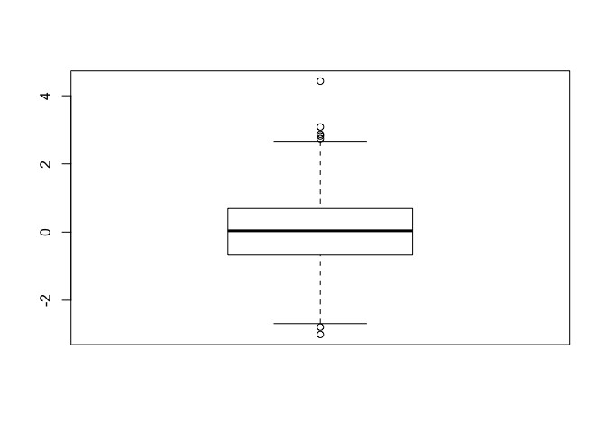
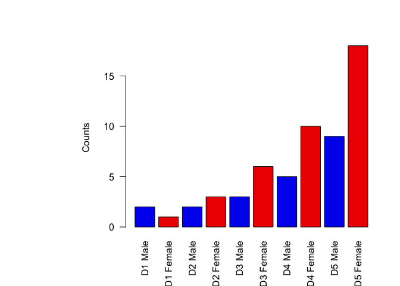

Class 05
================
Hongji Jiang
2019-10-31

``` r
#Class5 Data Visualization

x <- rnorm(1000)

#some summary stats
mean(x)
```

    ## [1] 0.02503196

``` r
sd(x)
```

    ## [1] 0.993658

``` r
summary(x)
```

    ##     Min.  1st Qu.   Median     Mean  3rd Qu.     Max. 
    ## -3.00462 -0.67387  0.03783  0.02503  0.68954  4.42873

``` r
boxplot(x)
```



``` r
hist(x)

rug(x)
```


``` r
# Section 2 scaterplots
weight <- read.table("bimm143_05_rstats/weight_chart.txt",header = TRUE)
plot(weight$Age, weight$Weight, type = 'o',pch = 15,cex = 1.5,lwd = 2,ylim=c(2,10))
```


``` r
mouse <- read.delim("bimm143_05_rstats/feature_counts.txt",header = TRUE)
head(mouse)
```

    ##            Feature Count
    ## 1    Messenger RNA 79049
    ## 2 Coding Sequences 50770
    ## 3            Genes 32029
    ## 4    Transfer RNAs 26248
    ## 5      CpG islands 13840
    ## 6      Pseudogenes  5195

``` r
par(mar=c(5,11,4,2))
barplot(mouse$Count,names.arg = mouse$Feature,horiz = TRUE,las =1)
```


``` r
hist(c(rnorm(10000),rnorm(10000)+4))
```


``` r
male <- read.delim("bimm143_05_rstats/male_female_counts.txt",header = TRUE)
barplot(male$Count,col=rainbow(10),names.arg = male$Sample,las = 2,ylab = "Counts")
```


``` r
barplot(male$Count,col=c("blue2","red2"),names.arg = male$Sample,las = 2,ylab = "Counts")
```



``` r
ud <- read.delim("bimm143_05_rstats/up_down_expression.txt",header = TRUE)
nrow(ud$Gene)
```

    ## NULL

``` r
plot(ud$Condition1, ud$Condition2, col=ud$State, 
     xlab="Expression condition 1", ylab="Expression condition 2")
```


