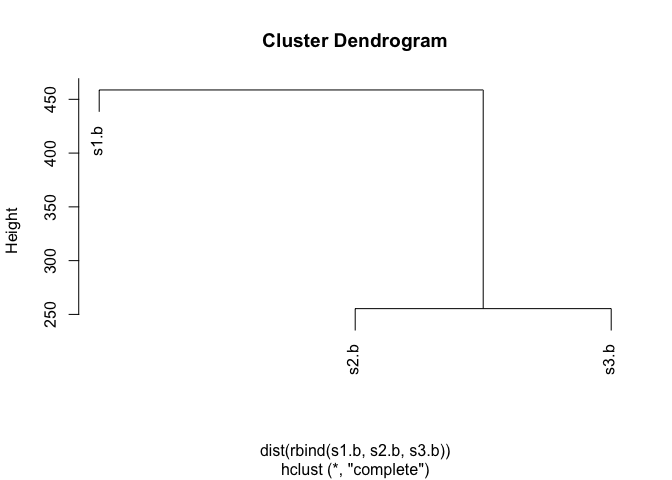
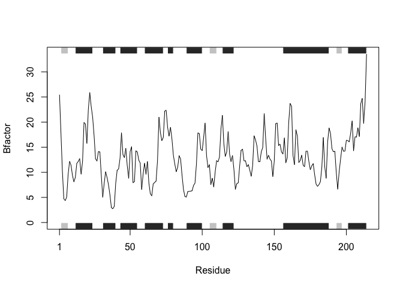

Class6 R functions
================
Hongji Jiang
10/17/2019

This is my work from class6 **BIMM143**.
========================================

``` r
#this is to demo a code chunk
plot(1:10)
```


Practice Reading Files(again...)
--------------------------------

``` r
read.table("test1.txt",sep = ",", header = TRUE)
```

    ##   Col1 Col2 Col3
    ## 1    1    2    3
    ## 2    4    5    6
    ## 3    7    8    9
    ## 4    a    b    c

``` r
read.table("test2.txt",sep = "$", header = TRUE)
```

    ##   Col1 Col2 Col3
    ## 1    1    2    3
    ## 2    4    5    6
    ## 3    7    8    9
    ## 4    a    b    c

``` r
read.table("test3.txt")
```

    ##   V1 V2 V3
    ## 1  1  6  a
    ## 2  2  7  b
    ## 3  3  8  c
    ## 4  4  9  d
    ## 5  5 10  e

``` r
add <- function(x, y=1) {
# Sum the input x and y 
  x+y
}
```

``` r
add(1)
```

    ## [1] 2

``` r
add(5,5)
```

    ## [1] 10

``` r
rescale <- function(x) {
   rng <-range(x)
   (x - rng[1]) / (rng[2] - rng[1])
}
```

``` r
rescale(1:10)
```

    ##  [1] 0.0000000 0.1111111 0.2222222 0.3333333 0.4444444 0.5555556 0.6666667
    ##  [8] 0.7777778 0.8888889 1.0000000

Test some

``` r
x<-c(1,2,NA,3,10)
rescale(c(1,2,NA,3,10))
```

    ## [1] NA NA NA NA NA

``` r
rng = range(x,na.rm = TRUE)
rng
```

    ## [1]  1 10

``` r
rescale2 <- function(x) {
   rng <-range(x,na.rm = TRUE)
   (x - rng[1]) / (rng[2] - rng[1])
}
```

``` r
rescale2(x)
```

    ## [1] 0.0000000 0.1111111        NA 0.2222222 1.0000000

``` r
 rescale3 <- function(x, na.rm=TRUE, plot=FALSE) {
    rng <-range(x, na.rm=na.rm)
    print("Hello")
   answer <- (x - rng[1]) / (rng[2] - rng[1])
   print("is it me you are looking for?")
   if(plot) {
      plot(answer, typ="b", lwd=4)
   }
   print("I can see it in ...")
   return(answer)
}
```

``` r
rescale3(1:10,plot=TRUE)
```

    ## [1] "Hello"
    ## [1] "is it me you are looking for?"


    ## [1] "I can see it in ..."

    ##  [1] 0.0000000 0.1111111 0.2222222 0.3333333 0.4444444 0.5555556 0.6666667
    ##  [8] 0.7777778 0.8888889 1.0000000

section2
========

Install the **bio3d** pakage for sequence and structure analysis

``` r
library(bio3d)
s1 <- read.pdb("4AKE")  # kinase with drug
```

    ##   Note: Accessing on-line PDB file

``` r
s2 <- read.pdb("1AKE")  # kinase no drug
```

    ##   Note: Accessing on-line PDB file
    ##    PDB has ALT records, taking A only, rm.alt=TRUE

``` r
s3 <- read.pdb("1E4Y")  # kinase with drug
```

    ##   Note: Accessing on-line PDB file

``` r
s1.chainA <- trim.pdb(s1, chain="A", elety="CA")
s2.chainA <- trim.pdb(s2, chain="A", elety="CA")
s3.chainA <- trim.pdb(s3, chain="A", elety="CA")
s1.b <- s1.chainA$atom$b
s2.b <- s2.chainA$atom$b
s3.b <- s3.chainA$atom$b
plotb3(s1.b, sse=s1.chainA, typ="l", ylab="Bfactor")
```


``` r
plotb3(s2.b, sse=s2.chainA, typ="l", ylab="Bfactor")
```


``` r
plotb3(s3.b, sse=s3.chainA, typ="l", ylab="Bfactor")
```


``` r
hc <- hclust( dist( rbind(s1.b, s2.b, s3.b) ) )
plot(hc)
```



``` r
# function describtion 
# this function takes in one argument x that is the name 
# of the pdb file 
# Output: it plots a plot with residue on x-label and 
# Bfactor on the y-label
plotp <- function(x)
{
  # read.pdb reads a protein data bank coordinate file
  # argument x is the name of the PDB file to read 
  s = read.pdb(x)
  # trim.pdb produces a smaller pdb object
  # it contains a subset of atoms 
  # argument elety: a character vector of atom names.
  # argument chain a character vecter of chain identifiers
  s.chainA <- trim.pdb(s, chain="A", elety="CA")
  s.b <- s.chainA$atom$b
  # plotb3: Draw a standard scatter plot
  # with optional secondary structure in the marginal regions.
  plotb3(s.b, sse=s.chainA, typ="l", ylab="Bfactor")
}
# Here I use the three examples above 
# to test my function
plotp("4AKE")
```

    ##   Note: Accessing on-line PDB file

    ## Warning in get.pdb(file, path = tempdir(), verbose = FALSE): /var/folders/
    ## d1/r9lcn8313z5_hg24vb00hp8w0000gn/T//RtmpyyMtid/4AKE.pdb exists. Skipping
    ## download


``` r
plotp("1AKE")
```

    ##   Note: Accessing on-line PDB file

    ## Warning in get.pdb(file, path = tempdir(), verbose = FALSE): /var/folders/
    ## d1/r9lcn8313z5_hg24vb00hp8w0000gn/T//RtmpyyMtid/1AKE.pdb exists. Skipping
    ## download

    ##    PDB has ALT records, taking A only, rm.alt=TRUE


``` r
plotp("1E4Y")
```

    ##   Note: Accessing on-line PDB file

    ## Warning in get.pdb(file, path = tempdir(), verbose = FALSE): /var/folders/
    ## d1/r9lcn8313z5_hg24vb00hp8w0000gn/T//RtmpyyMtid/1E4Y.pdb exists. Skipping
    ## download


