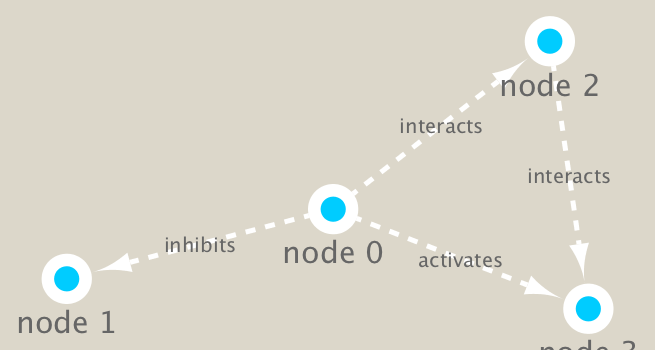

```{r setup, include=FALSE}
knitr::opts_chunk$set(echo = TRUE)
```

## Metageomics co-occurence networks 

Here examine data from the Tara Ocean project on bacteria in ocean water samples from arond the world
we would use the **igraph** pakage from CRAN and the **RCy3** package from bioconductor to build and visualize networks of this data.
```{r}
g <- makeSimpleGraph()
createNetworkFromGraph(g,"myGraph")
```
```{r}
fig <- exportImage(filename="demo", type="png", height=350)
```

```{r}

```


```{r}
setVisualStyle("Marquee")


```

```{r}
fig <- exportImage(filename="demo_marquee", type="png", height=350)


```


```{r}
styles <- getVisualStyleNames()
styles
setVisualStyle(styles[13])
setVisualStyle(styles[18])
plot(g)
```

```{r}
## scripts for processing located in "inst/data-raw/"
prok_vir_cor <- read.delim("./data/virus_prok_cor_abundant.tsv", stringsAsFactors = FALSE)

## Have a peak at the first 6 rows
head(prok_vir_cor)
```

```{r}
prok_vir_cor <- read.delim("virus_prok_cor_abundant.tsv", stringsAsFactors = FALSE)
```

```{r}
head(prok_vir_cor)
```

```{r}
g <- graph.data.frame(prok_vir_cor, directed = FALSE)
```

```{r}
class(g)
```

```{r}
g
```

```{r}
plot(g)
```

```{r}
plot(g, vertex.label=NA)
```

```{r}
plot(g, vertex.size=3, vertex.label=NA)
```

```{r}
ggraph(g, layout = 'auto') +
  geom_edge_link(alpha = 0.25) +
  geom_node_point(color="steelblue") +
  theme_graph()
```

```{r}
createNetworkFromIgraph(g,"myIgraph")
```

```{r}
cb <- cluster_edge_betweenness(g)
```

